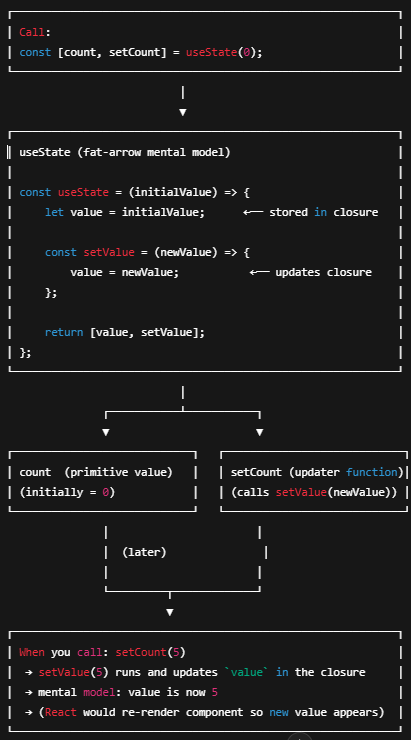

# JavaScript vs React State

---

## **1. Local Memory vs Global Memory**

### **Global Memory**

- Variables declared **outside functions** stay in the browser’s **global memory**.
- They **don’t reset** after each function call.

```js
let counter = 0; // global memory

const increase = () => {
    counter++;
    heading.innerText = counter;
}
```

Every time `increase()` runs, `counter` continues from its previous value.

---

### **Local Memory**

- Variables declared **inside** a function get **fresh memory** on every call.
- They are **destroyed** when the function ends.

```js
const increase = () => {
    let counter = 0; // local memory
    counter++;
    heading.innerText = counter;
}
```

This always shows **1**, because `counter` resets on every call.

---

### **Conclusion**

- **Global variable** → remembers value
- **Local variable** → resets each time
- This is normal JavaScript **scope behavior**.

Updating DOM like:

```js
heading.innerText = counter;
```

must be repeated everywhere → not ideal.

---

## **2. React State Problem**

React components are **functions**, and they **re-run** when UI updates.

If you store values in normal variables, they **reset**, because the entire component runs again.

---

## **3. React’s Solution → Hooks**

### **useState Hook**

- Keeps values **between re-renders**
- Acts like a **built-in memory system**

Import:

```js
import React from 'react';
import { useState } from 'react';
```

Destructuring:

```js
{ useState }
```

Means:  
“Take only `useState` from the big React object.”

---

## **4. Basic useState Structure**

```jsx
const Counter = () => {
    const [count, setCount] = useState(0);

    return (
        <>
        </>
    )
}
```

- `count` → current value
- `setCount` → function to update
- `useState(0)` → starting value

You can store **numbers, strings, booleans, arrays, objects — anything.**

---

## **5. How useState Works (Easy Logic)**

Imagine this conceptually:

```js
let arr = [1,2,3];
sort(arr);
```

We don’t know how `.sort()` works internally.  
Same with `useState()` — it’s React’s internal system.

Basic mental model:

```js
const useState = (a) => {
    count = a;
    return [count, setCount];
}
```

When we call:

```js
useState(0);
```

React stores `0` internally and returns:

```sh
[count, setCount]
```

The value is remembered because React has its own **internal memory**, not normal JS memory.

---

## **6. Updating State**

```jsx
const Counter = () => {
    const [count1, setCount1] = useState(0);

    const increase = () => {
        setCount1(count1 + 1);
    }

    return (
        <>
        <h1>counter</h1>
        </>
    )
}
```

### Important:

- `setCount1` → the function
- `setCount1()` → calling the function

When you do:

```js
setCount1(count1 + 1);
```

React:

1. Takes the new value
2. Stores it in its internal memory
3. Re-renders the component
4. Updates `count1`

---

## **7. useState with Different Values**

### Number

```js
const [count1, setCount1] = useState(0);
setCount1(1);
```

### String

```js
const [count1, setCount1] = useState("Rayyan");
setCount1("Muhammad Rayyan");
```

Works identical for **any data type**.

---

## ✔ Final Summary

- Global JS variables → remember value
- Local JS variables → reset
- React components re-run → normal variables reset
- `useState()` gives **permanent memory** inside React
- It returns: `[value, functionToUpdate]`
- `setCount()` tells React to update & re-render

---

# Basic Mental Model

---

## Dummy `useState` Mental Model

```js
const useState = (initialValue) => {
    let value = initialValue;

    const setValue = (newValue) => {
        value = newValue;   // pretend React updates its memory
    };

    return [value, setValue];
};
```

---

## Dummy `setCount` Mental Model

```js
const setCount = (newValue) => {
    count = newValue;  // pretend React updates the stored state
};
```

---

## How it behaves when called

```js
const [count, setCount] = useState(0);
```

- `count` → 0
- `setCount` → a function that changes the value later

---

## Quick Notes

- `useState(x)` → returns **value + updater function**
- `setCount(y)` → “update the value to y”

---

## Mini Example

```js
const [age, setAge] = useState(18);

setAge(19); // updates the value
```

---

These are **not real implementations**, just mental models so you understand how React “feels” inside.

<pre>
┌────────────────────────────────────────────────────────────┐
│ Call:                                                      │
│ const [count, setCount] = useState(0);                     │
└────────────────────────────────────────────────────────────┘
                           │
                           ▼
┌────────────────────────────────────────────────────────────┐
│ useState (mental model)                                    │
│                                                            │
│ const useState = (initialValue) => {                       │
│     let value = initialValue;      ←── stored in closure   │
│                                                            │
│     const setValue = (newValue) => {                       │
│         value = newValue;           ←── updates closure    │
│     };                                                     │
│                                                            │
│     return [value, setValue];                              │
│ };                                                         │
└────────────────────────────────────────────────────────────┘
                           │
               ┌───────────┴───────────┐
               ▼                       ▼
┌────────────────────────────┐   ┌────────────────────────────┐
│ count  (primitive value)   │   │ setCount (updater function)│
│ (initially = 0)            │   │ (calls setValue(newValue)) │
└────────────────────────────┘   └────────────────────────────┘
               │                       │
               │  (later)              │
               │                       │
               └─────────┬─────────────┘
                         ▼
┌────────────────────────────────────────────────────────────┐
│ When you call: setCount(5)                                 │
│  → setValue(5) runs and updates value in the closure       │
│  → mental model: value is now 5                            │
│  → (React would re-render component so new value appears)  │
└────────────────────────────────────────────────────────────┘

