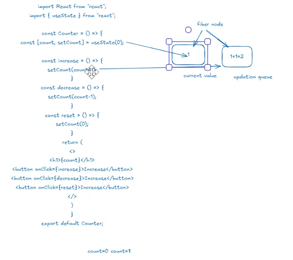

1. Value Updation

In react we can't put outside the function for global varibales

internal memory == fiber node

fiber node is created for each component
component is the main function of each file

we use setcount to update state

fiber node store 2 things
-> current value(holds the initial and updated values )
-> Updation queue

set count has direct link to fiber node memory (Updation queue)
usestate direcly links with fiber node memoy (current Value)

so set count send it's calculation to updation queue

so why don't he directly update cuurent value?

it is becuase it compares the updation queue with current value if there is difference it will update the current value

if any changes made functional compoenet rerenders

so when current changes the count value so it will  rerender

now here comes the fiber node functioning

so if we rerender then all the updated values will become 0
so we don't have current previous state in fiber node
setcount take this current and update the value and send to updation queue
and then both compares
if we don't have



now we can't make global variable but we instead use UseState

2. Compution effieicnt and Optimzed rerendering
   now take the case of string update

let say in linked in page my name is Rayyan
//now i want to update it like M. Rayyan
but let say if i say oh sorry let me keep it same as previous so Rayyan

now this goes to update in updation queue
now it check it's same as current by comparing it with updation queue
so it won't re render as it don't send updated value in current value
so therefore Compution power saves by not updating same values

and avoid rerendering

3. batch prcessing

in vanilla javascript ifƒi have 3 functions
like
increase()
decrease()
reset()
then it will execute functions one by one

But in React

let say we use it in a form for taking multiple inputs:

const info = () => {

    const [name , setName] = useState("Ali");// if we taking input from user then we have to set initial value as ""
    const [age, setAge] = useState("20");// if we taking number from user then we have to set initial value as 0
    const [city, setCity] = useState("Bhoun");
    
    setName("Rayyan");
    setAge(21);
    setCity("Chakwal");
    return (
        <></>
    )

}

then it updates

    setName("John");
    setAge(25);
    setCity("New York");

all these three in single run and this is done by batch processing of React
so it does like at one time it compares the virtual new and old dom
but in vanilla js it render it one by one

Without batch processing

    setName("John");
    setAge(25);
    setCity("New York");

old dom                     new dom
{pic1, 21, chakwal}          {pic2, 21, chakwal}

old dom                     new dom
{pic2, 21, chakwal}         {pic2, 30, chakwal}

old dom                     new dom
{pic2, 30, chakwal}         {pic2, 30, Lahore}

with batch Processing

    setName("John");
    setAge(25);
    setCity("New York");

old dom                     new dom
{pic1, 21, chakwal}         {pic2, 30, Lahore}

# 📚 React `useState` — Complete Clean Notes (All-in-One)

## **1. Value Updation (How React Stores & Updates State)**

* In React, **global variables** cannot be used for reactive data because they do not trigger re-renders.
* Every component has its own internal memory stored inside a **fiber node**.
* A fiber node holds two key parts:
   * **Current Value** 🧠 → Stores the latest, up-to-date state.
   * **Updation Queue** 📝 → Stores pending state updates.

### **How `useState` Works Internally**

* `useState()` is directly connected to the fiber node’s **current value** (for reading the state).
* `setState()` is connected to the fiber node’s **updation queue** (for writing the state).
* When you call a setter function (like `setCount()`):
   1. It sends the update to the **updation queue**.
   2. React processes the queue and compares the **current value** with the **new value**.
   3. If they are **different** → React updates the current value in the fiber node.
   4. The component is then scheduled to **re-render**.

### **Why React Doesn’t Update Current Value Directly**

* Direct updates would bypass the crucial **comparison step**.
* The comparison check is what prevents **unnecessary re-renders** (see Section 2).
* The Fiber architecture must track the previous and new state to ensure component stability during the render process.

### **Why State Doesn’t Reset**

* During every re-render, the `useState()` call reads the **stored value** from the fiber node, not the initial value passed to `useState(initialValue)`.
* This persistence ensures the state remains updated across renders instead of resetting.

---

## **2. Computation Efficiency & Optimized Re-Rendering**

### **Example**

1. **Current value:** `"Rayyan"`
2. You update it to: `"M. Rayyan"` (Different $\implies$ **Re-render**)
3. You then update it back to: `"Rayyan"`

* React checks: *Is the new value* (`"Rayyan"`) *the same as the current value* (`"Rayyan"`)?
* Since both are the **same**, React does **not** re-render the component.

### **Conclusion**

* React only re-renders when the new state value is **actually different** from the current state value.
* This optimization prevents:
   * Wasted CPU cycles ⚡
   * Unnecessary DOM updates 🖥️

---

## **3. Batch Processing (Multiple State Updates = One Render)**

### **Vanilla JavaScript Behavior**

* Functions are executed **synchronously** and **one-by-one**:

```javascript
increase(); // runs
decrease(); // runs
reset();    // runs
```

### **React's Batch Processing Behavior**

* When multiple state setter calls occur within the **same event handler** (or promise, timeout, etc. in modern React):

```jsx
setName("John");
setAge(25);
setCity("New York");
```

* React groups them together into one process (Batching) and performs:

   * **One** combined state update 🔄
   * **One** Virtual DOM comparison 🔍
   * **One final** re-render 🚀

* **Without Batch Processing (Hypothetical):** The DOM would be compared and updated three times (after each setter call), leading to slow performance.

* **With Actual Batch Processing:** React makes **one comparison** between the Old DOM and the final New DOM, making the application significantly faster and more optimized.

### **Final Summary**

React state works efficiently because:

1. State is stored persistently inside the **fiber node**.
2. `useState` accesses the **current value**; `setState` updates via the **queue**.
3. React **compares** old vs. new values before updating to prevent unnecessary work.
4. **Same values** do not trigger re-renders (performance optimized).
5. Multiple state updates are combined using **batch processing** for a single, fast render.