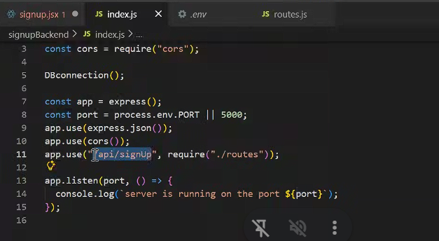
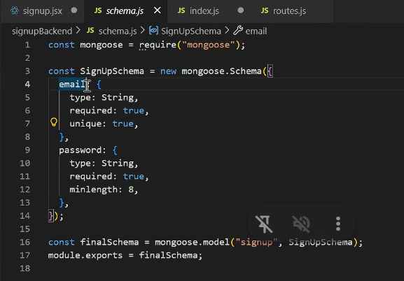

Fetch api is used to request fromfront end to backend
so we send data from front end to backend

there are different methods in fetch so we need to specify what to do with it
basically CRUD applications

like post = if we send data
get = if we fetch data from database
update = if we need to update
delete = remove from database

1 extra : patch = update a specific thing

like if i need to update login info
so if we change both email and password we use update
and if we update only one then we use patch

Postman is used to test APi's endpoints

Status Codes- request responses in the form of code is generated

1. if any code 200 to 299 (extreme included 200 and 299)all are ok
2. and 500 to 599 database issue or backend issue are server error
   in backend scheme we tell pasword length like contraints there
3. and 400 to 499 client issue like client added less data so server side validation is not satisfying client side data

Now Fetch

1. URL must match
2. Headers - tells what type of data i'm sending if post is used like image,text, etc...
3. Methods(today we tackle post only)
4. payloads / body -  the data entered from user to send to backend

https://localhost:5000"

the code 5000 depends upon ur system
one backend can get multiple requests
one gets one posts one updates etc

now 

the line app.use ("/api/login", require("./route"));

"/api/login" this matches with the front end fect code/"/api/login"
so frontend send the request to backend and then backend will check api/signup in backend once the request find it

try {
fetch("https://localhost:5000/api/signup", {
method: "POST",
headers: {
"Content-Type": "application/json",
},

        body: JSON.stringify({ 
          <!-- email: email, // key and value both are same but value is one which is fiber node currently 
          password: password , -->
          
          email,password
          
          }),
      })
    )}
    
    now how format is validated 
    
    it is done by schema in database
    
    
    email and password should match with this email and password writen here 
    
    
    when we send jason object over network it cant send so we need to convert it into string so we use JSON.stringyfy()
    
    
    now it will convert into string
    
    backend and frontend both usesJSON object but there communication is done by string formed data
    
    
    
    res: {
        ok: false
        url: https://localhost:5000/api/signup
    }
    
    res.ok
    
    console.log("Response:", res);
      const recData = res.json();
      console.log("Received Data:", recData);
      if(!res.ok){
        throw new Error(recData.message);
      }
    
    
      why throw comes in ?
    
      as before there was no actual data getting from database
      we created a jason objec₺so we don't need throw
    
      but in actual database it's a difficult for catch to get a all errors
      so we make it handy for catch by self defining using throw
    
    
    
      now let say if registration is done sucessfully now we don't need fiber node data so we need to clear the fiber node
    
    so we write setEmail("")
      setPassword("")
    
      now it will go to updateion q then comparison as both different so the current will get updated with empty
    
    
      console.log("Response:", res);
      const recData = res.json();
      console.log("Received Data:", recData);
      if(!res.ok){
        throw new Error(recData.message);
      }
      console.log("User signed up successfully:", recData);
      alert("User signed up successfully!");
      setEmail("")
      setPassword("")
    }
    
    
    now we need to  false te isLoading
    
      finally{
            setIsLoading(false);
        }
    
    
        now i also want to display the error on my signup page for that purpose we need to creat e a usestate for error and fro catch we will set the error 
    
        const SignUp = () => {
      const [email1, setEmail] = useState("");
      const [password1, setPassword] = useState("");
      const [isLoading, setIsLoading] = useState(false);
    
      const [error, setError] = useState(null);
    
      const handleFormSub = (e) => {
        e.preventDefault();
        console.log("Form Submitted");
        setIsLoading(true);
    
        try {
            const res = fetch("https://localhost:5000/api/signup", {
            method: "POST",
            headers: {
              "Content-Type": "application/json",
            },
            // body: JSON.stringify({ email, password }),
            body: JSON.stringify({ 
              email: email1, // key and value both are same but value is one which is fiber node currently 
              password: password1 }),
          })
          console.log("Response:", res);
          const recData = res.json();
          console.log("Received Data:", recData);
          if(!res.ok){
            throw new Error(recData.message || "user has not registered yet");
          }
          console.log("User signed up successfully:", recData);
          alert("User signed up successfully!");
          setEmail("")
          setPassword("")
        
        }
        catch (error) {
            console.log("Error:", error.message);
            setError(error.message);
        }
        finally{
            setIsLoading(false);
        }
      };
    
    
    shortcircuiting
    if one condition wrog  it wont check next one
    
    
    
{error && {error}

    
    so if error exit then only go further
    
    if we use || then if first condition is true it will not check next one